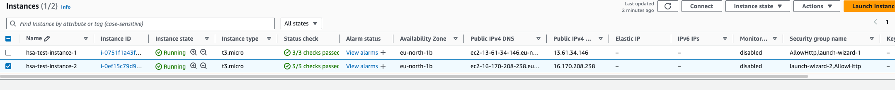
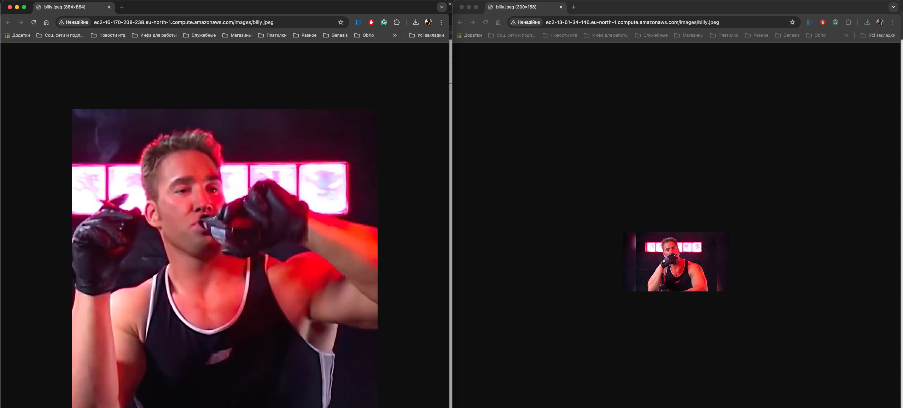
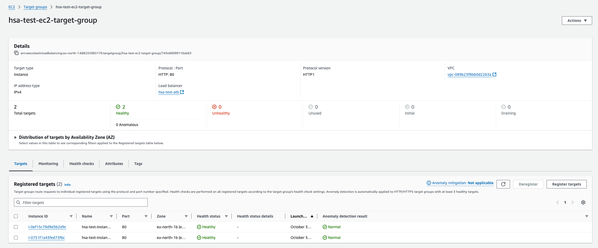
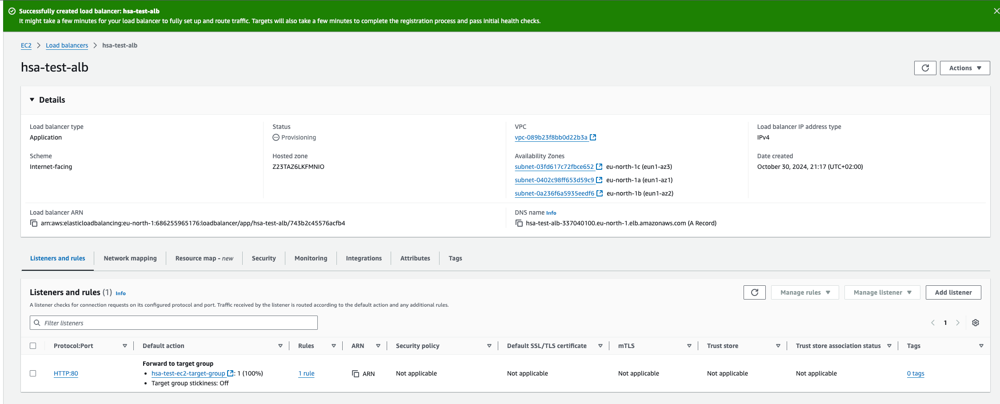
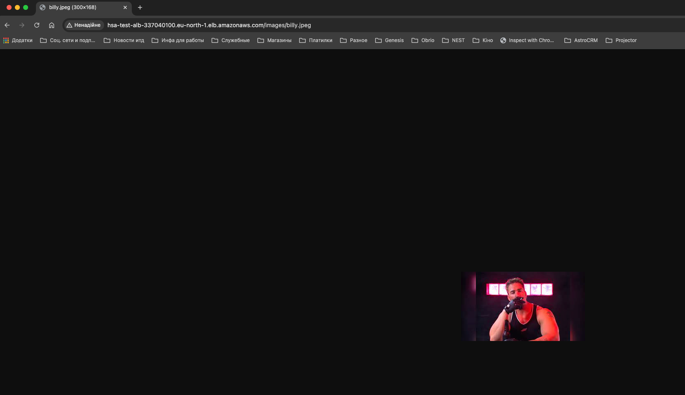

# hsa-ec2-load-balancer

# Task
Create 2 micro instances in AWS.

Setup application load balancer and assign instances to it.

# Solution
1. Created 2 EC2 instances and configured each with nginx server serving `/images/*` to internet (2 different files with same name created on them)
   1. 
   2. 
2. Create target group 
   1. 
3. Create load balancer (ALB) and configured it to use target group created earlier
   1. 
4. After heading to ALB external address and requesting resource filename existing on each instance
   1. 
   2. 